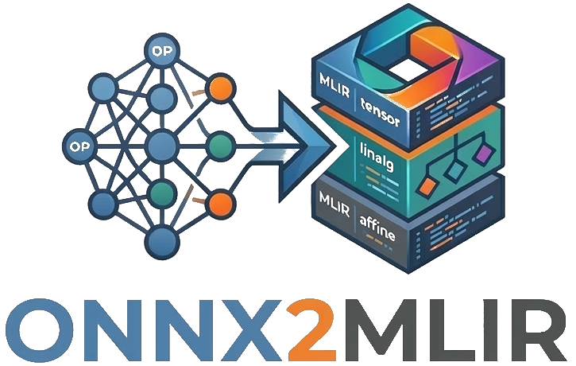

# ONNX2MLIR

ONNX2MLIR dialect mappings for composable optimizations.

ONNX for MLIR is a graph converter for MLIR Linalg/Affine dialects with composable Transform optimizations.

-------------------------------------------------------
