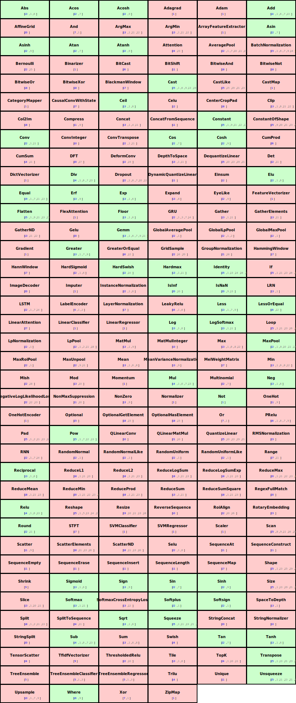

# ONNX2MLIR

ONNX2MLIR dialect mappings for composable optimizations


ONNX to MLIR is a graph converter for MLIR Linalg/Affine dialects with composable Transform optimizations.

---------------------------------------------------------------------------------------------------------

#### ONNX graph
```textproto
<
   ir_version: 11,
   opset_import: ["" : 23],
   producer_name: "onnx-example"
>
graph subtract_graph (
  %input_a[FLOAT, 2x3]
  %input_b[FLOAT, 2x1]
) {
  %output_c = Sub(%input_a, %input_b)
  return %output_c
}
```

#### MLIR onnx dialect
```mlir
module {
  func.func @main(
              %arg0: tensor<2x3xf32> {onnx.name = "input_a"},
              %arg1: tensor<2x1xf32> {onnx.name = "input_b"})
              -> (tensor<2x3xf32> {onnx.name = "output_c"}) {
    %0 = onnx.Sub(
            A = %arg0 : tensor<2x3xf32>
            B = %arg1 : tensor<2x1xf32>
            attributes {onnx.node.name = "/subtract0"}
        ) : tensor<2x3xf32>
    return %0 : tensor<2x3xf32>
  }
}
```

#### MLIR linalg + affine + transform
```mlir
#map = affine_map<(d0, d1) -> (d0, d1)>
#map1 = affine_map<(d0, d1) -> (d0, 0)>
module {
  func.func @main(
              %arg0: tensor<2x3xf32> {onnx.name = "input_a"},
              %arg1: tensor<2x1xf32> {onnx.name = "input_b"})
              -> (tensor<2x3xf32> {onnx.name = "output_c"}) {
    %0 = tensor.empty() : tensor<2x3xf32>
    %1 = linalg.elementwise kind=#linalg.elementwise_kind<sub>
            indexing_maps = [#map, #map1, #map]
            {transform.target_tag = "onnx.Sub"}
            ins(%arg0, %arg1 : tensor<2x3xf32>, tensor<2x1xf32>)
            outs(%0 : tensor<2x3xf32>) -> tensor<2x3xf32>
    return %1 : tensor<2x3xf32>
  }
}
```

---------------------------------------------------------------------------------------------------------


## About

#### Overview
  * API design with booth: **python** (first) and **c++**
  * ONNX2MLIR ships as reusable library for any ML/MLC project
  * ONNX2MLIR ships with standalone tools as graph optimizers

#### The ONNX dialect
  * MLIR Onnx dialect is **self generated** out of onnx internal schema
  * MLIR Onnx dialect covers the ops including historic **backward versions**
  * MLIR Onnx dialect is fully **assembled**, **parametrized** and **tracked**
  * MLIR Onnx dialect ops are **test covered** ensurring specs compliance

#### The MLIR Linalg lowering backend
  * MLIR Onnx dialect gets lowered to **Linalg** (**TOSA** is considered WiP)
  * MLIR Linalg uses **Transform** dialect **tags** for further optimizations
  * MLIR lowered ops are **test covered** against original onnx evaluators

#### The LLVM runtime executor
  * The executor runtime is **python first** and can lower via LLVM
  * The executor runtime use **reconfigurable passes** on lowering pipeline
  * The executor runtime can emmit reusable DSO for **any target machine**

---------------------------------------------------------------------------------------------------------

## Coverage

#### Onnx to Linalg

The latest coverage report is also in: [docs/coverage-onnx2linalg.htm](docs/coverage-onnx2linalg.htm)

## Motto

Keep it simple, it works the best !
